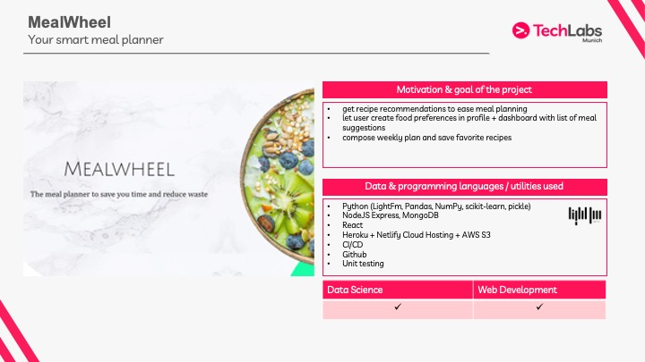
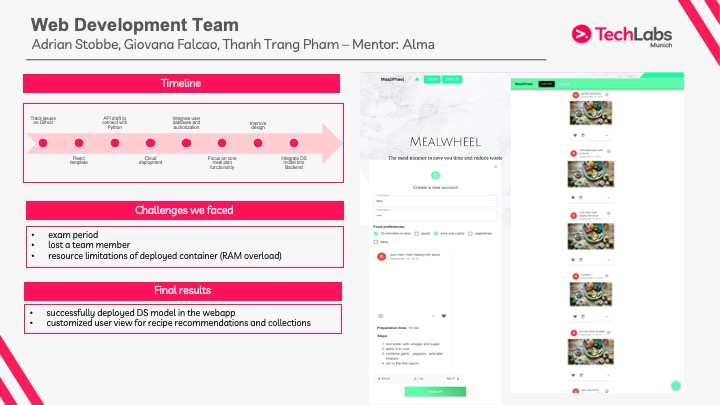

# Mealwheel - A smart mealplanner

This project was part of the Techlabs 2020 Web Dev Track Munich. We worked in two teams: data science and web development to build a mealplanner website to organize and ease choosing what to eat.

Unfortunately, the project is not financially rentable to maintain the backend server cost long term, but I provided the frontend link anyways in case you want to have a link at it :)
https://mealwheel.netlify.app/

These are the slides from the final pitch that show what the app is capable of:

The repo for the backend can be found [here](https://github.com/elchead/mealwheel-back).
